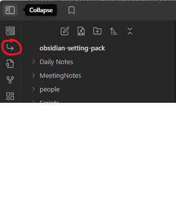

# Obsidian settings pack for organize managers work

## Features

- People cards, one place for:
  - All tasks
  - All data
  - All meeting
- Regular meeting
  - One to one template with:
    - news
    - topics from previous one to ones
    - topics from another meetings
  - Regular group meeting:
    - Topics from previous meeting
    - Topics by tags
    - Block for meeting with task from all person
  - Template for interview
- Databases

## Installation

- [Install obsidian](https://help.obsidian.md/Getting+started/Download+and+install+Obsidian)
- Clone or download this repository
- Open cloned folder as vault
- Use!

## Usage

Main button

### Create people card

You can create 

### Create template for regular meetings

### Create meeting motes for regular meeting

## How you can improve this pack

### Feedback

Share feedback, issues, and ideas on Github!

### Credits

This plugin is being designed and developed by Nikolo